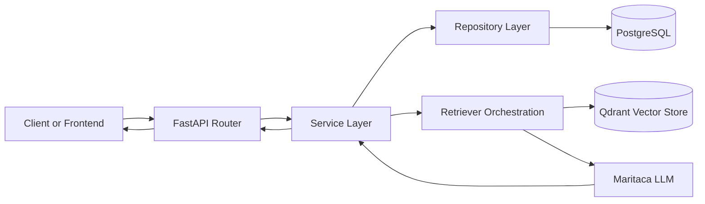

# Bula AI


*A Retrieval-Augmented Generation (RAG) assistant bringing clarity to Brazilian medication leaflets through AI and clean architecture.*

> Preview space for screenshot demonstrating the end-to-end flow.
>
> <br>
>
>  <br>
> 
> <br>
>
> 

Bula AI helps people understand Brazilian medication leaflets (bulas) through natural language questions. Users upload a PDF and receive responses grounded in retrieved passages from the document, reducing hallucination risk and improving answer traceability.

## Context and Objectives

This repository is intentionally written for two audiences: thesis reviewers and professional evaluators.

| Audience | Why Bula AI matters | What this repository demonstrates |
|---|---|---|
| Academic (TCC) | Applies AI to a relevant public-health communication problem in Brazil. | Problem framing, RAG methodology, architecture decisions, and technical rigor. |
| Professional (Portfolio) | Shows practical backend engineering for an AI product. | Modular architecture, testing strategy, migrations, observability, and DX tooling. |

Primary objectives:

- Improve accessibility of medication information without sacrificing reliability.
- Prioritize grounded responses using retrieval over free-form generation.
- Keep the codebase maintainable, testable, and reproducible.

## Current Scope

- User authentication with JWT.
- PDF leaflet upload and metadata management.
- Retrieval-oriented question answering flow.
- API-first backend for integration with frontend clients.
- Request tracing and structured logging for debugging and monitoring.

## Architecture Overview

The backend follows a modular monolith structure, organized by domain:

- auth
- bulas
- rag
- chat

Each module follows layered responsibilities:

- router: HTTP contract and response handling.
- service: business rules and orchestration.
- repository: database access.
- schemas: request and response validation.
- models: persistence mapping.



## Tech Stack

- **Backend:** Python 3.12, FastAPI (async)
- **Database:** PostgreSQL 16 via the first-party `bula_ai_postgres` image
- **ORM and Migrations:** SQLAlchemy 2 async, Alembic
- **Auth:** JWT, Argon2id-based password hashing
- **AI and Retrieval:** LangChain, Maritaca API integration, Qdrant-ready retrieval architecture
- **Tooling:** uv, Ruff, pytest, pytest-asyncio, pytest-cov
- **Infrastructure:** Docker, Docker Compose, Makefile workflows

## Academic and Professional Quality Criteria

The project is developed with criteria that support both thesis evaluation and engineering quality:

- Clear problem definition and technical scope.
- Reproducible execution flow.
- Separation of concerns and consistent module boundaries.
- Automated tests for core behavior.
- Traceability through structured logs and correlation IDs.
- Versioned database evolution through migrations.

Example production-style structured log:

```json
{
   "event": "http_request_completed",
   "level": "info",
   "timestamp": "2026-04-18T19:32:51.287Z",
   "correlation_id": "3f8d98dd-ef74-40de-a8ac-2ed2f6f92909",
   "method": "POST",
   "path": "/api/v1/auth/login",
   "status_code": 200,
   "duration_ms": 87.42,
   "user_id": 12
}
```

## Getting Started

### Prerequisites

- [Docker](https://docs.docker.com/get-docker/)
- [Docker Compose](https://docs.docker.com/compose/install/)
- Make (recommended)

### Running the project

1. (Optional) Copy the example environment file and adjust values if needed:

   ```bash
   cp .env.example .env
   ```

   PowerShell alternative:

   ```powershell
   Copy-Item .env.example .env
   ```

2. Start all services with a single command:

   ```bash
   make up
   ```

   Docker Compose alternative:

   ```bash
   docker compose up -d
   ```

   Docker will build the backend image and start both the API and the database.
   The PostgreSQL service uses the first-party GHCR image
   `ghcr.io/yuussuke/bula_ai_postgres:0.8.1-pg16`. If the package visibility is
   private, authenticate with `docker login ghcr.io` before running `make up`.

### Accessing the API

Once the containers are running, open your browser or use `curl` to reach the health-check endpoint:

```bash
curl http://localhost:8000/health
# → {"status":"ok"}
```

The interactive API docs (Swagger UI) are also available at:

```
http://localhost:8000/docs
```

### API Testing with Bruno

The repository includes a ready-to-use Bruno collection in [bruno/bula-ai-api](bruno/bula-ai-api). The login request stores the JWT token automatically in the environment and authenticated requests reuse it via Bearer auth, improving developer experience when validating endpoints.

Main files:

- [bruno/bula-ai-api/opencollection.yml](bruno/bula-ai-api/opencollection.yml)
- [bruno/bula-ai-api/Authentication/Login.yml](bruno/bula-ai-api/Authentication/Login.yml)
- [bruno/bula-ai-api/Authentication/get-my-profile.yml](bruno/bula-ai-api/Authentication/get-my-profile.yml)
- [bruno/bula-ai-api/chat/direct-ask.yml](bruno/bula-ai-api/chat/direct-ask.yml)
- [bruno/bula-ai-api/bulas/upload-file.yml](bruno/bula-ai-api/bulas/upload-file.yml)

## Useful Commands

- Start services: `make up`
- Stop services: `make down`
- Follow logs: `make logs`
- Run migrations: `make migrate`
- Verify PostgreSQL extensions and FTS: `make verify-postgres`
- Create an admin user: `make create-admin ARGS="--email admin@example.com --full-name 'Admin User'"`
- Run tests: `make test`
- Run tests with coverage: `make test-cov`
- Lint: `make lint`
- Format: `make format`

Public registration through `/api/v1/auth/register` always creates regular
`user` accounts. Administrative users are created through the internal
management command exposed by `make create-admin`.

## PostgreSQL Image and Local Data

Local development and CI use the first-party PostgreSQL image
`ghcr.io/yuussuke/bula_ai_postgres:0.8.1-pg16`, which bundles pgvector support
and PostgreSQL full-text-search capabilities needed by the later BM25 work.

Use `make verify-postgres` after `make up` to confirm that the running database
can create `vector` and `unaccent` extensions and execute Portuguese FTS.

When changing database image tags, prefer resetting the local database early:

```bash
make reset-db
```

This removes the Compose-managed database volume and reruns migrations. It is
destructive for local data. The Compose volume is declared as `postgres_data`;
Docker usually materializes it as `bula-ai_postgres_data`.

## Automated Dependency Updates

This repository uses Dependabot to keep dependencies up to date with controlled PR volume and clear review ownership.

- Configuration file: `.github/dependabot.yml`
- Schedule: weekly (Monday at 09:00)
- Reviewer: `Yuussuke`
- Ecosystems covered:
   - `uv` for backend Python dependencies (`/backend`)
   - `npm` for frontend dependencies (`/frontend`)
   - `docker` for backend image references (`/backend`)
   - `docker` for frontend image references (`/frontend`, pre-configured for future Dockerfile)
   - `docker` for the first-party PostgreSQL image (`/docker/bula_ai_postgres`)
   - `docker` for root Compose image references (`/`)
   - `github-actions` for workflow action versions (`/`)

Policy notes:

- Minor and patch dependency updates are grouped separately from major updates for `uv` and `npm`.
- Major Docker/runtime updates should be validated in staging before production rollout.
- The first-party PostgreSQL image tag mirrors its Dockerfile `FROM` tag and is versioned separately from application releases.
- PostgreSQL major upgrades and pgvector major upgrades require manual compatibility review.
- Security-driven updates should be prioritized, even when noise-reduction ignore rules are in place.

## Roadmap

- Improve retrieval quality and context ranking.
- Expand chat experience and conversation memory handling.
- Add broader integration coverage for critical user flows.
- Consolidate evaluation metrics for academic reporting.

## Language Note

The engineering documentation, architecture terms, and commit history follow English conventions to align with global software standards. At the same time, the product domain, source documents, and NLP evaluation context are Brazilian Portuguese, because the real-world healthcare scenario addressed by this project is Brazilian.

## Note

This README is intentionally written as a public project showcase for both thesis reviewers and professional portfolio readers. Internal coding-agent rules and development constraints are documented in AGENTS.md.
