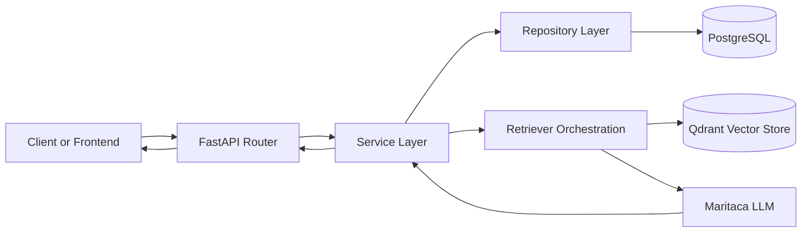

# Bula AI


*A Retrieval-Augmented Generation (RAG) assistant bringing clarity to Brazilian medication leaflets through AI and clean architecture.*

> Preview space for screenshot demonstrating the end-to-end flow.
>
> <br>
>
>  <br>
> 
> <br>
>
> 

Bula AI helps people understand Brazilian medication leaflets (bulas) through natural language questions. Users upload a PDF and receive responses grounded in retrieved passages from the document, reducing hallucination risk and improving answer traceability.

## Context and Objectives

This repository is intentionally written for two audiences: thesis reviewers and professional evaluators.

| Audience | Why Bula AI matters | What this repository demonstrates |
|---|---|---|
| Academic (TCC) | Applies AI to a relevant public-health communication problem in Brazil. | Problem framing, RAG methodology, architecture decisions, and technical rigor. |
| Professional (Portfolio) | Shows practical backend engineering for an AI product. | Modular architecture, testing strategy, migrations, observability, and DX tooling. |

Primary objectives:

- Improve accessibility of medication information without sacrificing reliability.
- Prioritize grounded responses using retrieval over free-form generation.
- Keep the codebase maintainable, testable, and reproducible.

## Current Scope

- User authentication with JWT.
- PDF leaflet upload and metadata management.
- Retrieval-oriented question answering flow.
- API-first backend for integration with frontend clients.
- Request tracing and structured logging for debugging and monitoring.

## Architecture Overview

The backend follows a modular monolith structure, organized by domain:

- auth
- bulas
- rag
- chat

Each module follows layered responsibilities:

- router: HTTP contract and response handling.
- service: business rules and orchestration.
- repository: database access.
- schemas: request and response validation.
- models: persistence mapping.


```mermaid
flowchart LR
   U[Client or Frontend] --> R[FastAPI Router]
   R --> S[Service Layer]
   S --> REPO[Repository Layer]
   REPO --> PG[(PostgreSQL)]
   S --> RET[Retriever Orchestration]
   RET --> Q[(Qdrant Vector Store)]
   RET --> LLM[Maritaca LLM]
   LLM --> S
   S --> R
   R --> U
```

## Tech Stack

- **Backend:** Python 3.14, FastAPI (async)
- **Database:** PostgreSQL 18 via the first-party `bula_ai_postgres` image
- **ORM and Migrations:** SQLAlchemy 2 async, Alembic
- **Auth:** JWT, Argon2id-based password hashing
- **AI and Retrieval:** LangChain, Maritaca API integration, Qdrant-ready retrieval architecture
- **Tooling:** uv, Ruff, pytest, pytest-asyncio, pytest-cov
- **Infrastructure:** Docker, Docker Compose, Makefile workflows

## Academic and Professional Quality Criteria

The project is developed with criteria that support both thesis evaluation and engineering quality:

- Clear problem definition and technical scope.
- Reproducible execution flow.
- Separation of concerns and consistent module boundaries.
- Automated tests for core behavior.
- Traceability through structured logs and correlation IDs.
- Versioned database evolution through migrations.

Example production-style structured log:

```json
{
   "event": "http_request_completed",
   "level": "info",
   "timestamp": "2026-04-18T19:32:51.287Z",
   "correlation_id": "3f8d98dd-ef74-40de-a8ac-2ed2f6f92909",
   "method": "POST",
   "path": "/api/v1/auth/login",
   "status_code": 200,
   "duration_ms": 87.42,
   "user_id": 12
}
```

## Getting Started

### Prerequisites

- [Docker](https://docs.docker.com/get-docker/)
- [Docker Compose](https://docs.docker.com/compose/install/)
- Make (recommended)

### Running the project

1. (Optional) Copy the example environment file and adjust values if needed:

   ```bash
   cp .env.example .env
   ```

   PowerShell alternative:

   ```powershell
   Copy-Item .env.example .env
   ```

2. Start all services with a single command:

   ```bash
   make up
   ```

   Docker Compose alternative:

   ```bash
   docker compose up -d
   ```

   Docker will build the backend image and start both the API and the database.
   The PostgreSQL service uses the first-party GHCR image
   `ghcr.io/yuussuke/bula_ai_postgres:18`. If the package visibility is
   private, authenticate with `docker login ghcr.io` before running `make up`.

### Accessing the API

Once the containers are running, open your browser or use `curl` to reach the health-check endpoint:

```bash
curl http://localhost:8000/health
# → {"status":"ok"}
```

The interactive API docs (Swagger UI) are also available at:

```
http://localhost:8000/docs
```

### API Testing with Bruno

The repository includes a ready-to-use Bruno collection in [bruno/bula-ai-api](bruno/bula-ai-api). The login request stores the JWT token automatically in the environment and authenticated requests reuse it via Bearer auth, improving developer experience when validating endpoints.

Main files:

- [bruno/bula-ai-api/opencollection.yml](bruno/bula-ai-api/opencollection.yml)
- [bruno/bula-ai-api/Authentication/Login.yml](bruno/bula-ai-api/Authentication/Login.yml)
- [bruno/bula-ai-api/Authentication/get-my-profile.yml](bruno/bula-ai-api/Authentication/get-my-profile.yml)
- [bruno/bula-ai-api/chat/direct-ask.yml](bruno/bula-ai-api/chat/direct-ask.yml)
- [bruno/bula-ai-api/bulas/upload-file.yml](bruno/bula-ai-api/bulas/upload-file.yml)

## Useful Commands

- Start services: `make up`
- Stop services: `make down`
- Follow logs: `make logs`
- Run migrations: `make migrate`
- Install PGQueuer objects: `make pgq-install`
- Upgrade PGQueuer objects: `make pgq-upgrade`
- Verify PGQueuer objects: `make pgq-verify`
- Verify PostgreSQL extensions and FTS: `make verify-postgres`
- Create an admin user: `make create-admin ARGS="--email admin@example.com --full-name 'Admin User'"`
- Discover ANVISA records: `make download-anvisa-bulas ARGS="--headless --discover Amoxicilina"`
- Download pinned ANVISA targets: `make download-anvisa-bulas ARGS="--headless --targets scripts/anvisa_targets.json --limit 1"`
- Preview the system seed: `make seed-system-bulas ARGS="--admin-email admin@example.com --dry-run"`
- Run tests: `make test`
- Run tests with coverage: `make test-cov`
- Lint: `make lint`
- Format: `make format`

Public registration through `/api/v1/auth/register` always creates regular
`user` accounts. Administrative users are created through the internal
management command exposed by `make create-admin`.

New passwords are checked against the free Pwned Passwords range API using
k-anonymity: only the first five characters of a locally computed SHA-1 lookup
hash leave the backend, while stored passwords continue to use Argon2id. The
check uses response padding and a two-second timeout. Registration fails open
when the external service is unavailable so local development remains usable.
Set `PASSWORD_BREACH_ENABLED=false` to disable this check explicitly.

PDF ingestion runs through a separate PGQueuer worker. On a new local database,
run `make migrate` for application tables and `make pgq-install` for queue
tables before uploading bulas.

The ingestion worker relies on the Compose restart policy for database listener
resilience: `docker-compose.yml` runs it with `restart: always` and
`--shutdown-on-listener-failure`, so a broken PGQueuer listener exits and is
restarted by the supervisor instead of maintaining custom reconnect logic in the
application process. Jobs left in `picked` state by an interrupted worker become
eligible for another worker after
`RAG_INGESTION_STALE_JOB_RETRY_AFTER_SECONDS` (five minutes by default). Active
jobs send heartbeats and are not reclaimed while they continue processing.

For local or operator debugging, set `RAG_INGESTION_DEBUG=true` and optionally
`RAG_INGESTION_DEBUG_PATH=tmp/rag-ingestion-debug` before starting the API and
worker. Each ingestion run writes a manifest, parsed markdown, and chunking
result artifacts under the configured path. These files can contain parsed bula
text, so keep the path local/private and inspect warnings with `make logs`.

Small adjacent Markdown sections are grouped into fewer semantic chunking
requests by default. `PROCESSING_CHUNK_BATCH_MAX_TOKENS` controls the estimated
source-token budget for a combined request, while
`PROCESSING_CHUNK_BATCH_MAX_SECTIONS` limits response complexity. A section that
already exceeds the token budget remains a standalone request. Set
`PROCESSING_CHUNK_BATCH_ENABLED=false` to compare against the legacy
one-section-per-request behavior.

The model only proposes source-text boundaries. Before any chunk can reach the
embedding stage, the worker normalizes whitespace, reconstructs source spans,
and requires complete ordered coverage exactly once for every section. Chunk
titles come from the nearest validated Markdown heading, never from model
output. Unknown text, omissions, duplicate/reordered/overlapping spans, strict
JSON failures, truncation, provider errors, and timeouts all route directly to
the local deterministic Markdown splitter. There is no secondary semantic
model in this recovery path.

The deterministic splitter keeps Markdown tables and bullet items together
when they fit. Oversized tables split between rows with their header repeated;
oversized lists split between items. `PROCESSING_CHUNK_MAX_TOKENS` remains the
absolute final chunk limit, and no text is truncated to meet it.

Each OpenRouter chunking request has an explicit timeout configured through
`OPENROUTER_CHUNK_TIMEOUT_SECONDS` (60 seconds by default). SDK-level retries are
disabled by default with `OPENROUTER_CHUNK_MAX_RETRIES=0`. The deadline wraps
only the provider request; validation and deterministic fallback run locally
outside its cancellation scope. A failed batch falls back section by section in
the original source order without another provider request.

Semantic chunking defaults to the versioned `retrieval_v3` contract with
`google/gemini-3.1-flash-lite`, temperature `0`, seed `17`, and a 5,000-token
output cap. OpenRouter requests require supported parameters, ZDR routing, and
`data_collection=deny`; prompt/request bodies are never written to logs or
debug manifests. Model calls run sequentially until a later benchmark justifies
bounded concurrency. The local deterministic splitter is the only fallback.

Before manually reviewing three or four complete ingestions, compare the new
default against the former Gemini path on the six focused Dipirona/Amoxicilina
sections. This command uses the same prompt, request builder, validator,
fallback, diagnostics, parser, and configured embedding provider as the worker:

```bash
make benchmark-semantic-chunking
```

The ignored report at
`backend/tmp/semantic-chunking-benchmark/results.json` records source validity,
critical dosage/list preservation, latency, provider-reported usage/cost,
fallback rate, embedding vector count, and the generated chunks for manual
inspection. It contains no API key, provider request body, or prompt text.

### ANVISA system corpus

The system corpus uses an explicit discovery, selection, download, operator
validation, and seed workflow. The downloader runs on the host because
Playwright is a development dependency; the seed runs inside the API container.

Install the downloader dependency and its browser once:

```bash
cd backend
uv sync --dev
uv run playwright install chromium
cd ..
```

First discover the records returned by ANVISA without downloading a PDF:

```bash
make download-anvisa-bulas ARGS="--headless --discover Amoxicilina"
```

Discovery excludes the short-lived protected download tokens. It shows the
stable patient/professional source record IDs together with the ANVISA product
ID, registration, process, expedition, transaction, manufacturer, and source
timestamps. Never select a result using only an active ingredient or the newest
record from a manufacturer.

The repository contains one pinned candidate in
`backend/scripts/anvisa_targets.json` for the initial system seed. Verify its
exact product, strength, pharmaceutical form, presentation, audience, and source
record in the official Bulário before use. Use
`backend/scripts/anvisa_targets.example.json` only when adding another target.
The configured `expected_pdf_terms` must identify the product, strength, and
form in the selected PDF.

Download only the pinned targets and generate manifest schema version 2:

```bash
make download-anvisa-bulas ARGS="--headless --targets scripts/anvisa_targets.json --limit 1"
```

PDFs and the generated manifest are stored in
`backend/tmp/anvisa-bulas-v2/`, an ignored directory. The separate v2 directory
keeps legacy schema-version-1 downloads untouched and prevents them from being
resumed accidentally. Downloads are written to `.pdf.part`, parsed with the
same 10 MB limit used by uploads, checked for the configured identity terms,
and atomically moved into place. The manifest is also written atomically.

The manifest records the exact regulatory identity, canonical ANVISA query,
local filename, byte length, SHA-256 checksum, timestamps, and downloader
version. A file is reused only when its target and source identity match the
current result and its parsed bytes match the manifest. Changed sources, missing
files, checksum mismatches, partial files, corrupt PDFs, duplicate filenames,
and conflicting source identities are rejected or freshly downloaded. Schema
version 1 manifests are intentionally rejected. Legacy `review` metadata in a
schema-version-2 manifest is accepted but ignored.

Running the seed is the administrator's deliberate enqueue action. Before doing
so, the operator must inspect the selected manifest entry and PDF in the
official Bulário and confirm the product, strength, pharmaceutical form,
presentation, audience, manufacturer, registration, and source record. There is
no separate approval command or review-state edit in the local system-corpus
workflow.

With the API, worker, database, and queue running, preview one validated entry:

```bash
make seed-system-bulas ARGS="--admin-email admin@example.com --dry-run --limit 1"
```

Then execute the same operator-validated seed without `--dry-run`. The owner
must already be an active administrator. The command parses each PDF, validates
its size and checksum, creates bulas with `corpus=system`, and enqueues the
normal `ingest_bula` job. The exact ANVISA product name is stored as the bula
name and the canonical ANVISA query as its source URL.

Seeding and ingestion never publish a document. The seed stores the complete
manifest provenance with publication state `staged`; a successful worker run
changes only the ingestion status to `ready`. This preserves the operator
validation boundary above without accepting legacy manifest review metadata as
publication evidence.

After the worker reports `ready`, record the independent review and publication
decisions with an active reviewer or administrator account:

```bash
make manage-system-bula ARGS="vet --bula-id <uuid> --actor-email reviewer@example.com --notes 'Compared with the selected ANVISA record and PDF'"
make manage-system-bula ARGS="publish --bula-id <uuid> --actor-email admin@example.com"
```

Only an administrator can publish or withdraw a document. Administrators and
reviewers can vet or reject it. A withdrawal or rejection requires a reason:

```bash
make manage-system-bula ARGS="withdraw --bula-id <uuid> --actor-email admin@example.com --notes 'ANVISA source changed'"
make manage-system-bula ARGS="reject --bula-id <uuid> --actor-email reviewer@example.com --notes 'Presentation does not match the selected record'"
```

Authenticated clients discover system bulas through `GET /api/v1/bulas/system`
and `GET /api/v1/bulas/system/{bula_id}`. Both endpoints expose only documents
whose corpus is `system`, ingestion status is `ready`, publication state is
`published`, and stored-object checksum and size still match the vetted
provenance. The dense chat endpoint applies the same policy. Private bulas
remain queryable only by their owner, while `shared` corpus access stays closed
until its separate review workflow is implemented.

`canonical_source_url` preserves the exact ANVISA search request used during
selection. It is an API provenance reference, not a guaranteed browser link:
ANVISA's security layer can require an established Bulário session or block a
direct request. To review a document manually, open the official Bulário
Eletrônico and search using the stored product, manufacturer, registration,
expedition, and source-record identity.

### Dense chat sessions

Start a conversation for a queryable bula with
`POST /api/v1/chat/sessions/{bula_id}/ask`. Continue it with
`POST /api/v1/chat/sessions/{session_id}/messages`; each successful request
persists the user and assistant messages together. The service rebuilds the
prompt history from PostgreSQL on every follow-up and sends at most the last 10
complete turns to the model, so restarting the API does not erase context.

Authenticated users can reload their own conversations with
`GET /api/v1/chat/sessions` and `GET /api/v1/chat/sessions/{session_id}`.
Session ownership is enforced as a not-found response, and continuing a session
also rechecks the current bula access policy. A withdrawn or otherwise
unqueryable system bula cannot receive new chat turns.

### Dense retrieval quality contract

The default `intfloat/multilingual-e5-large` model uses the asymmetric E5
retrieval contract: document text is embedded as `passage: <text>` and user
queries as `query: <text>`. Every Qdrant point stores an `embedding_profile`,
and the dense retriever filters by that exact profile as well as `bula_id`.
This fails closed instead of silently mixing vectors produced by different
models or input contracts.

After deploying a new embedding profile, existing Qdrant points must be
re-embedded before they can be queried. Validate and then update one bula
without parsing the PDF or running semantic chunking again:

```bash
make reindex-bula-embeddings ARGS="--bula-id <uuid> --dry-run"
make reindex-bula-embeddings ARGS="--bula-id <uuid>"
```

The reindex command reads the existing chunks, computes every vector before
writing, preserves point IDs and payload metadata, and then records the active
embedding profile. It does not change publication or ingestion status.

For follow-up turns, the retrieval query includes the medication name and the
previous user question when the new question is context-dependent. The dense
retriever over-fetches candidates but returns at most four evidence-bearing
chunks; Markdown headings without body content are not sent to the answer
model or exposed as sources. No fixed similarity threshold is applied before
the retrieval evaluation has calibrated one for this corpus.

The answer prompt treats retrieved chunks as a sample rather than proof of the
entire leaflet. If evidence is insufficient, it must say that the information
was not found in the retrieved excerpts instead of claiming that it does not
exist in the complete leaflet. Answers cite context using numeric references;
only the cited chunks are returned as visible sources, in citation order.

### PostgreSQL BM25 index (Phase 5 foundation)

New ingestions persist their source chunks to `chunk_meta` after Qdrant and
before `ready`. Both stores must succeed. PostgreSQL replacement is transactional
per bula and removes obsolete lexical chunks. A failed write propagates to the
worker retry policy; repeating the write does not duplicate rows. There is no
distributed transaction with Qdrant. Existing ready bulas are populated explicitly
using the backfill below, not by parsing or embedding them again.

The index uses **real BM25 via pg_textsearch 1.1.0**, already included in our
first-party PostgreSQL image. It does not use `ts_rank_cd` or a Python in-memory
index. Versioned database normalization combines Portuguese stemming before
accent folding with the previous accent-folding-first path. It is applied to
both indexing and queries without modifying stored source text. The internal
`search_text` column is maintained by a PostgreSQL trigger and indexed with
the `simple` configuration so its already-normalized terms are not stemmed again.
Search results contain positive BM25 scores (higher is better), not probabilities
or scores normalized to [0, 1]. The chat still uses dense retrieval until #55–#57
and #51 wire in the additional modes.

For the first local upgrade, pause ingestion and apply the migration before
restarting the worker:

```bash
docker compose stop worker
make migrate
make backfill-chunk-meta ARGS="--bula-id <uuid> --dry-run"
make backfill-chunk-meta ARGS="--bula-id <uuid>"
docker compose up -d worker
```

The API and PostgreSQL must already be running for `make migrate`; Qdrant must
also be running for backfill. If the environment is down, first start
`docker compose up -d postgres qdrant api`.

Omit `--bula-id` to process **all ready bulas**, including private ones, as an
operator. This command is not an HTTP endpoint. Use `--dry-run` first and run it
only with no concurrent ingestion, deletion, or corpus changes. `--batch-size`
(1–1000, default 100) controls database listing and Qdrant scroll pages; one bula's
chunks are held in memory for complete validation before its transactional write.
If a later bula fails, earlier completed bulas remain committed; rerunning is safe.
Missing chunks, malformed payloads, and identity mismatches fail the selected
document before any of its index is replaced. Current PostgreSQL metadata is
authoritative for corpus/name; the source `chunk_id`, not the Qdrant point UUID,
is preserved. Historical payloads without `doc_id` derive it from `bula_id`.

The command does not modify PDFs, vectors, publication status, or chats and makes
no model calls. Do not run backfill against a collection containing known stale
or duplicate source chunks: it copies the current Qdrant content, not a repaired
version of it. A corpus filter is not an authorization check; future user-facing
retrievers must enforce the existing publication/ownership policy first.

Real PostgreSQL tests require a **separate migrated test database** (its name
must contain `test`). Set `BM25_TEST_DATABASE_URL` to its asyncpg URL, then run:

```bash
cd backend
uv run pytest -q tests/integration/rag/test_bm25_index.py
```

CI runs these tests in the migration job with the first-party PostgreSQL image.
Without that explicit URL these integration tests are skipped, never redirected
to the application database or simulated with SQLite. The pre-existing SQLite
fixtures for unrelated modules remain unchanged.

Design deviations from #32, ranking limitations, and the #55 handoff are recorded
in [the BM25 decision note](docs/decisions/2026-09-19-postgres-bm25.md).

### Standalone BM25 retriever (#55)

`app.modules.rag.bm25_retriever.BM25Retriever` adapts the persistent index to
LangChain's `BaseRetriever`. It performs no embedding or LLM calls. Its async
`ainvoke(question)` returns ranked `Document` objects with the original text,
`chunk_id`, `doc_id`, `bula_id`, `corpus`, `drug_name`, and `section_title`.
`score` and `bm25_score` both hold the positive BM25 score (not a probability).
`Document.id` is the original chunk ID, not a Qdrant point ID.

Inject `get_bm25_retriever_factory` through FastAPI `Depends`, then construct a
retriever **after** the application service has authorized the selected bula:

```python
retriever = factory.build(bula_id=authorized_bula.id, k=10)
documents = await retriever.ainvoke(question)
```

The factory reuses the injected request-scoped index/session; it is not a global
singleton. SQL and Portuguese normalization remain in the PostgreSQL index,
not in the LangChain adapter. A small `BM25SearchIndex` protocol allows tests to
replace persistence without mocking the retriever itself.

- `k` is bounded to 1–100. Bula and corpus filters are applied together.
- Markdown ATX heading-only chunks are excluded before top-k selection. Stored
  source chunks remain unchanged; paragraphs, lists and tables remain eligible.
- `corpus=None` means no corpus filter; an empty corpus returns no documents.
- Blank queries and no matches return `[]`. Database errors propagate rather
  than being presented as absence of evidence in the leaflet.
- Use `ainvoke`, not synchronous `invoke`. Do not run concurrent queries on
  the same session; for `abatch`, use `config={"max_concurrency": 1}` or allocate
  separate sessions per concurrent operation.
- This remains an internal component: filters do not replace ownership and
  publication authorization. Unscoped searches include private chunks.
- The chat still uses dense retrieval. Mode selection and hybrid fusion are
  separate work; no new endpoint or UI mode is introduced here.

The #32 BM25 decision also applies to #55: `to_bm25query`/native BM25 replace
the card's `plainto_tsquery`/`ts_rank_cd` examples. The normalization migration
`f6c8d2a91b40` fixes the specific `contraindicação`/`contraindicações` regression,
with passing tests in both directions. Tests also cover accent-insensitive
spellings, other inflections, source preservation, term frequencies, and numbers.
That migration uses no word-specific substitutions or expected-failure tests.

A subsequent query-only guard restores missing accents for an explicit leaflet
vocabulary (for example `contraindicacoes` → `contraindicações`) before the shared
database normalizer runs. This also retrieves prose such as `contraindicada`.
It is **not** general spelling correction: `amoxicilinna` is left unchanged.
See [the quality follow-up decision](docs/decisions/2026-09-20-bm25-query-quality.md)
for supported terms, boundaries, and regression tests. This follow-up requires
only updated application code; if already at `f6c8d2a91b40`, no additional
migration, backfill, or PDF reprocessing is required. Restart long-running API
processes to load the code (`docker compose restart api`). The standalone manual
test starts a fresh process and sees bind-mounted backend changes immediately.

If #32's migration/backfill is already applied, **do not repeat the Qdrant
backfill** for this normalization change. After updating the local code, pause
ingestion and other writes, then run:

```bash
docker compose stop worker
make migrate
docker compose exec api uv run alembic current
docker compose up -d worker
```

The expected revision is `f6c8d2a91b40 (head)`. This transactional migration
populates the derived column from existing `chunk_meta.chunk_text` and rebuilds
only the PostgreSQL BM25 index. It takes table locks, so schedule a maintenance
window for a large corpus. It does not read PDFs, change original chunks, access
Qdrant, or call embedding/LLM providers. New inserts/updates maintain the derived
column automatically. A downgrade restores the previous lexical index without
deleting original chunks; roll application code back together with the schema.

Normalization and ranking tradeoffs, including linguistic limitations, are in
[the #55 decision note](docs/decisions/2026-09-20-bm25-portuguese-normalization.md).

Validation (PostgreSQL tests require the isolated database described above):

```bash
cd backend
uv run pytest -q tests/unit/rag/test_bm25_retriever.py
uv run pytest -q tests/integration/rag/test_bm25_index.py
```

### Scoped hybrid retriever

`HybridRetrieverFactory` builds one retrieval pipeline for an already authorized
bula. Both the dense and BM25 retrievers receive the same `bula_id` and fetch
`2 * k` candidates. `HybridRetriever` then combines their ranks with equal-weight
Reciprocal Rank Fusion (RRF), using the standard constant `60`, deduplicates by
the stable `chunk_id`, and returns at most `k` documents.

Fusion is rank-based: dense similarity and BM25 scores are retained only as
diagnostics (`dense_score` and `bm25_score`) and are never compared directly.
The final `score` is the RRF score. Results also expose source-specific ranks and
`retrieval_sources` so evaluations can explain why a chunk was selected.

`EnrichingRetriever` performs one batched Qdrant payload lookup after final
top-k selection. It fills only allowlisted source metadata such as medication,
manufacturer and section. Existing values are never silently overwritten. A
missing payload leaves the fused document usable, while identity, source-text or
metadata disagreements fail explicitly because they indicate index drift.

Inject `get_hybrid_retriever_factory` with FastAPI `Depends` and build the
retriever only after the service has authorized access to the selected bula:

```python
retriever = factory.build(bula_id=authorized_bula.id, k=4)
documents = await retriever.ainvoke(question)
```

This is an internal retrieval component. It does not add an endpoint, expose a
UI mode, or change the chat's current default. It requires no migration,
backfill, re-embedding or PDF reprocessing. The decision, consistency contracts
and rollout boundary are recorded in
[the hybrid retrieval decision](docs/decisions/2026-09-22-hybrid-retrieval-rrf.md).

### RAG ingestion observability

The PGQueuer ingestion worker emits structured logs for every RAG ingestion run.
Use `make logs` and filter by `run_id` or `bula_id` when multiple PDFs are being
processed at the same time.

Stable events:

- `rag_ingestion_started`: one log at the beginning of a run.
- `rag_ingestion_stage_started`: DEBUG-only marker for a stage start.
- `rag_ingestion_stage_finished`: one log per completed or failed stage.
- `rag_ingestion_finished`: final summary, emitted on success and failure.

Stable fields:

- Correlation: `log_schema_version`, `run_id`, `bula_id`, `doc_id`.
- Stage timing: `stage`, `stage_status`, `duration_ms`.
- Final summary: `ingestion_status`, `total_duration_ms`,
  `stage_durations_ms`, `slowest_stage`, `slowest_stage_duration_ms`.
- Safe counters/context: `pdf_size_bytes`, `extraction_tier`, `section_count`,
  `batch_count`, `model_call_count`, `batch_fallback_count`, `chunk_count`,
  `embedding_vector_count`, `qdrant_point_count`, `qdrant_collection`,
  `error_type`.

Example final summary:

```json
{
  "event": "rag_ingestion_finished",
  "run_id": "7b0f1c48-5c47-4bc7-845d-2b784f97b0bd",
  "bula_id": "11111111-1111-1111-1111-111111111111",
  "ingestion_status": "succeeded",
  "total_duration_ms": 5832.91,
  "stage_durations_ms": {
    "bula_lookup": 12.42,
    "mark_processing": 18.35,
    "object_metadata": 9.11,
    "pdf_download": 22.6,
    "pdf_parse_to_markdown": 741.84,
    "chunk_markdown": 3170.02,
    "write_debug_artifacts": 4.18,
    "embed_chunks": 1420.77,
    "qdrant_ensure_collection": 28.53,
    "qdrant_upsert": 381.09,
    "mark_ready": 24.0
  },
  "slowest_stage": "chunk_markdown",
  "slowest_stage_duration_ms": 3170.02
}
```

To answer "which step dominated this run?", inspect `slowest_stage` first, then
compare the ordered `stage_durations_ms` object for the full profile. The logs
intentionally do not include API keys, PDF bytes, parsed markdown, prompts, raw
model responses, or chunk text. Set `LOG_LEVEL=DEBUG` only when you need
per-section or per-batch chunking details such as `rag_section_chunked` and
`rag_chunking_batch_completed`.

Uploads are intentionally limited to 10 MB. Validation reads the PDF in chunks
and stops once the configured limit is exceeded; after validation, the current
local storage path reads the accepted file into memory. Raising this limit should
come with a DoS/memory review and a streaming object-storage strategy.

## PostgreSQL Image and Local Data

Local development and CI use the first-party PostgreSQL image
`ghcr.io/yuussuke/bula_ai_postgres:18`, which bundles pgvector, pgvectorscale,
pg_textsearch, and Portuguese full-text-search capabilities needed by the later
BM25 work.

Use `make verify-postgres` after `make up` to confirm that the running database
can create `vector`, `vectorscale`, `pg_textsearch`, and `unaccent` extensions
and execute Portuguese FTS.

When changing database image tags, prefer resetting the local database early:

```bash
make reset-db
```

This removes the Compose-managed database volume and reruns migrations. It is
destructive for local data. The Compose volume is declared as `postgres_data`;
Docker usually materializes it as `bula-ai_postgres_data`. PostgreSQL 18 mounts
this volume at `/var/lib/postgresql`, letting the image create its
major-version-specific data directory.

## Automated Dependency Updates

This repository uses Dependabot to keep dependencies up to date with controlled PR volume and clear review ownership.

- Configuration file: `.github/dependabot.yml`
- Schedule: weekly (Monday at 09:00)
- Reviewer: `Yuussuke`
- Ecosystems covered:
   - `uv` for backend Python dependencies (`/backend`)
   - `npm` for frontend dependencies (`/frontend`)
   - `docker` for backend image references (`/backend`)
   - `docker` for frontend image references (`/frontend`, pre-configured for future Dockerfile)
   - `docker` for the first-party PostgreSQL image (`/docker/bula_ai_postgres`)
   - `docker` for root Compose image references (`/`)
   - `github-actions` for workflow action versions (`/`)

Policy notes:

- Minor and patch dependency updates are grouped separately from major updates for `uv` and `npm`.
- Major Docker/runtime updates should be validated in staging before production rollout.
- The first-party PostgreSQL image tag mirrors its Dockerfile `FROM` tag and is versioned separately from application releases.
- PostgreSQL major upgrades and pgvector major upgrades require manual compatibility review.
- Security-driven updates should be prioritized, even when noise-reduction ignore rules are in place.

## Roadmap

- Improve retrieval quality and context ranking.
- Expand chat experience and conversation memory handling.
- Add broader integration coverage for critical user flows.
- Consolidate evaluation metrics for academic reporting.

## Language Note

The engineering documentation, architecture terms, and commit history follow English conventions to align with global software standards. At the same time, the product domain, source documents, and NLP evaluation context are Brazilian Portuguese, because the real-world healthcare scenario addressed by this project is Brazilian.

## Note

This README is intentionally written as a public project showcase for both thesis reviewers and professional portfolio readers. Internal coding-agent rules and development constraints are documented in AGENTS.md.
